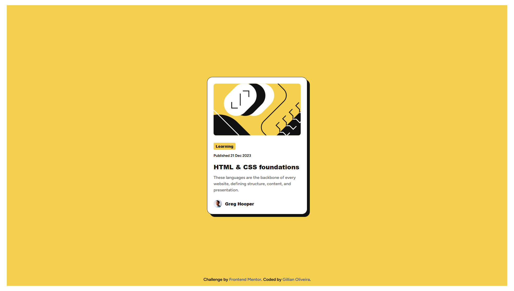

# Frontend Mentor - Blog preview card

This is a solution to the [Blog preview card challenge on Frontend Mentor](https://www.frontendmentor.io/challenges/blog-preview-card-ckPaj01IcS). Frontend Mentor challenges help you improve your coding skills by building realistic projects.

## Table of contents

- [Frontend Mentor - Blog preview card](#frontend-mentor---blog-preview-card)
  - [Table of contents](#table-of-contents)
  - [Overview](#overview)
    - [The challenge](#the-challenge)
    - [Screenshot](#screenshot)
    - [Links](#links)
  - [My process](#my-process)
    - [Built with](#built-with)
    - [What I learned](#what-i-learned)
    - [Continued development](#continued-development)


## Overview

### The challenge
Users should be able to:

- See hover and focus states for all interactive elements on the page

### Screenshot

Expected solution:


My solution:


### Links
- Solution URL: [Blog Card Preview Repo](https://github.com/lia-oliveira/blog-preview-card)
- Live Site URL: [Blog Card Preview Live Site]()

## My process

### Built with

- Semantic HTML5 markup
- CSS custom properties
- CSS Variables
- CSS Font-Faces
- Flexbox
- CSS Grid
- Mobile-first workflow

### What I learned

1. How to use the <body> tag to center the card.

```css
body{
    min-height: 100vh;
    display: flex;
    justify-content: center;
    align-items: center;
}
```

2. How to make the mobile version take up the full width of the screen.

Taking into account that the card spans 4 columns in the original design.
```css
main{
    grid-column: span 4;
}
```

3. How to keep the image from overflowing the container.
```css
main img {
    width: 100%;
    object-fit: cover;
}
```

4. How to apply states to links.
```css
main h1 a:hover{
    color:var(--Yellow);
}

main h1 a:focus{
    color:var(--Yellow);
}
```

### Continued development
I intend to continue studying how to position elements using a combination of CSS Grid and Flexbox.

Perhaps it would have been easier to position the elements by splitting the grid into rows rather than columns.